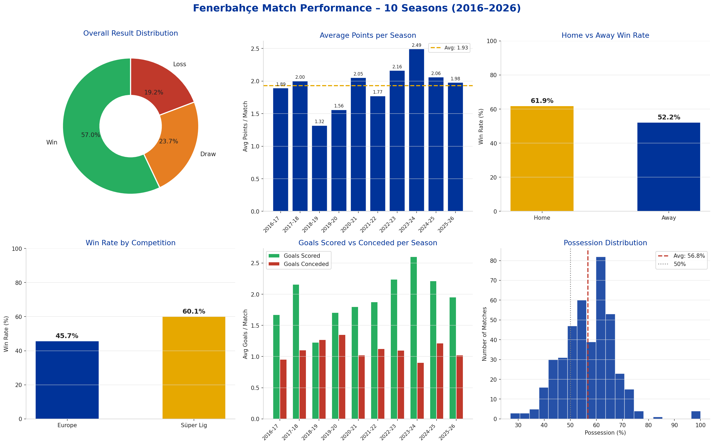
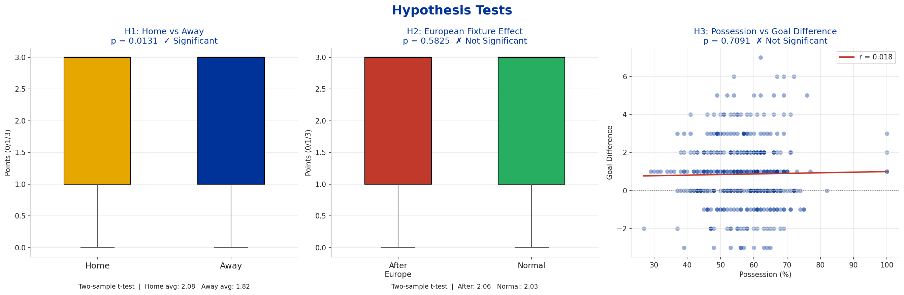
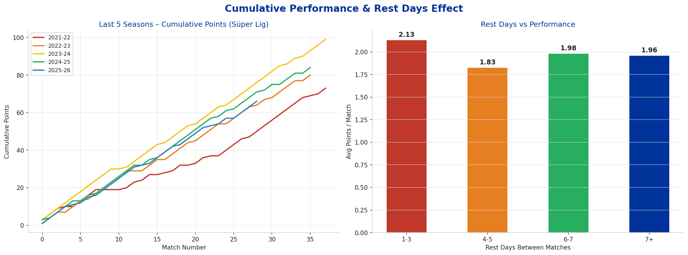
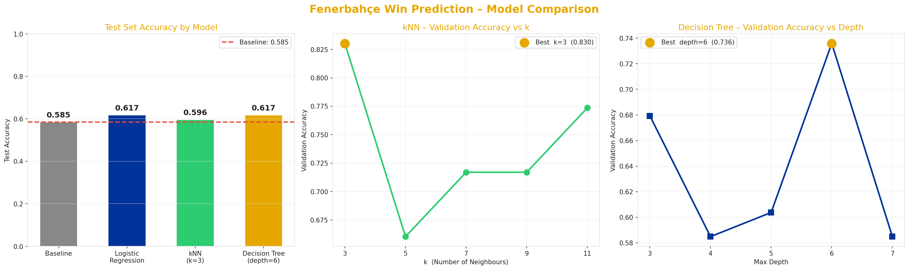
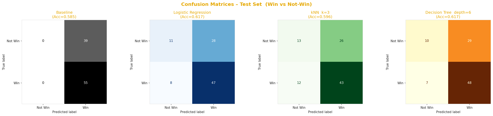
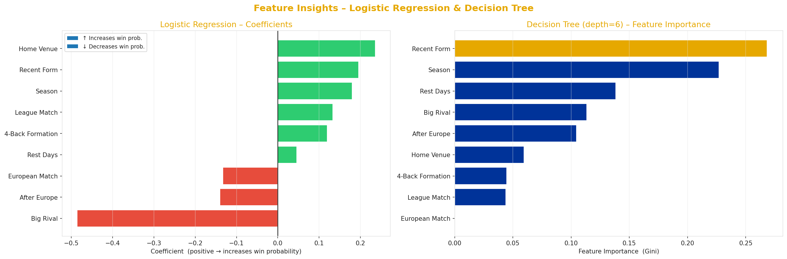
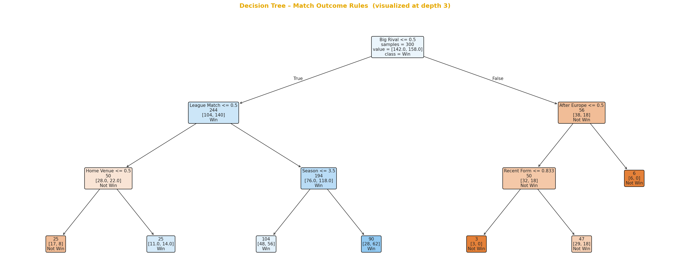
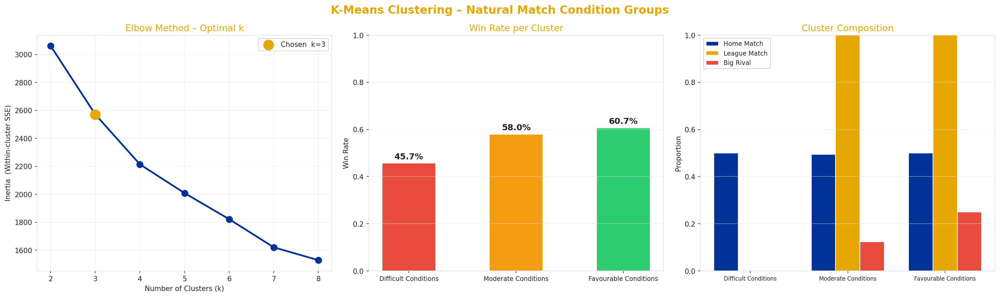

# Fenerbahçe Match Performance Analysis
**DSA210 – Spring 2026 | Damla Kandemir**

## Project Overview

This project analyzes the factors affecting Fenerbahçe's match performance across different competitions — Süper Lig and European tournaments — over 10 seasons (2016–2026). Rather than focusing on a single variable, the goal is to take a broader look at how contextual factors such as home advantage, fixture congestion, opponent strength, and competition type relate to match outcomes.

**Research Question:** Which factors are most related to Fenerbahçe's match performance across league and European competitions?

---

## Dataset
- **Source:** [FBref](https://fbref.com/en/squads/ae1e2d7d/Fenerbahce-Stats)
- **Period:** 2016–2026 (10 seasons)
- **Total matches:** 447
- **Competitions:** Süper Lig (353), Europa League (63), Conference League (17), Champions League (14)
- **Features:** Date, Venue (Home/Away), Competition, Result, Goals For, Goals Against, Possession, Formation, Opponent

---

## Hypotheses Tested

| # | Hypothesis | Test | Result |
|---|-----------|------|--------|
| H1 | Fenerbahçe performs better at home than away | Two-sample t-test | ✅ Significant (p = 0.0131) |
| H2 | League performance drops after a European match | Two-sample t-test | ❌ Not significant (p = 0.5825) |
| H3 | Higher possession correlates with better goal difference | Pearson correlation | ❌ Not significant (r = 0.018, p = 0.7091) |

---

## Key Findings (EDA)
- **Win rate:** 57.0% overall (Home: 61.9% | Away: 52.2%)
- **Home advantage** is statistically significant (p = 0.0131), confirming that playing at home meaningfully increases the likelihood of winning.
- **European fixture fatigue** does not significantly reduce league points (p = 0.5825), suggesting Fenerbahçe manages rotation effectively.
- **Possession** is not a strong predictor of goal difference (r = 0.018), indicating that Fenerbahçe's style is not purely possession-based.

---

## Visualizations

### General Performance (10 Seasons)


### Hypothesis Tests


### Cumulative Points & Rest Days Effect


---

## Machine Learning Methods

### Task
The ML task is formulated as a **binary classification** problem. The target variable is whether Fenerbahçe won the match (Win = 1) or not (Draw/Loss = 0). Goals scored, goals conceded, possession, and match points were excluded from model inputs — these are not known before the match and would cause **data leakage**.

In addition to supervised classification, **K-Means Clustering** was applied as an unsupervised method to discover natural groupings in match conditions, independent of the result.

### Features Used

| Feature | Description |
|---------|-------------|
| Home Venue | Whether Fenerbahçe played at home (1) or away (0) |
| League Match | Whether the match was a Süper Lig game (1) or European (0) |
| European Match | Whether the match was a European competition |
| After Europe | Whether a league match followed directly after a European fixture |
| Rest Days | Number of days since the previous match |
| Season | Ordinal season number (captures trend over years) |
| 4-Back Formation | Whether Fenerbahçe used a 4-defender formation |
| Big Rival | Whether the opponent was Galatasaray, Beşiktaş, Trabzonspor, or Başakşehir |
| Recent Form | Rolling average of points from the previous 3 matches |

### Train / Validation / Test Split

A **chronological split** was used to avoid future information leakage — the model learns from the past and is evaluated on more recent seasons:
- **Train:** 2016–17 to 2022–23 → 300 matches
- **Validation:** 2023–24 → 53 matches (used for hyperparameter selection)
- **Test:** 2024–25 and 2025–26 → 94 matches (final evaluation only)

---

### Supervised Learning Results

| Model | Val Accuracy | Test Accuracy |
|-------|-------------|---------------|
| Majority Class Baseline | 0.792 | 0.585 |
| Logistic Regression | 0.717 | **0.617** |
| kNN (best k = 3) | 0.830 | 0.596 |
| Decision Tree (best depth = 6) | 0.736 | **0.617** |

- **Logistic Regression** and **Decision Tree** both outperform the majority class baseline (0.585) on the test set, reaching **61.7% accuracy**.
- kNN achieved the highest validation accuracy but generalized less well, likely due to overfitting to local patterns in the training set.
- The best k for kNN (3) and best depth for Decision Tree (6) were selected using the validation set only — the test set was never seen during tuning.

#### Model Comparison & Hyperparameter Selection


#### Confusion Matrices


#### Feature Insights (LR Coefficients & DT Feature Importance)


#### Decision Tree – Match Outcome Rules


---

### Unsupervised Learning – K-Means Clustering

Beyond predicting outcomes, K-Means Clustering was applied to all 447 matches to discover whether **natural groups of match conditions** exist in the data — without using the result as input.

The **Elbow Method** identified **k = 3** as the optimal number of clusters. The three clusters correspond to meaningfully different match contexts:

| Cluster | Win Rate | Avg Rest Days | League % | Big Rival % | Interpretation |
|---------|----------|---------------|----------|-------------|----------------|
| Difficult Conditions | 45.7% | 6.4 | 0% | 0% | Mainly European matches, lowest win rate |
| Moderate Conditions | 58.0% | 3.8 | 100% | 12% | Congested league schedule |
| Favourable Conditions | 60.7% | 8.3 | 100% | 25% | Normal league matches, highest win rate |

**Key finding:** The algorithm separated European matches from league matches as a primary boundary — supporting the exploratory finding that competition type is a strong differentiator of match conditions, even if European fixture fatigue alone was not statistically significant in hypothesis testing.

#### K-Means Clustering Results


---

### Key ML Findings
- **Home venue** is the strongest positive predictor of winning, consistent with H1.
- **Recent form** (rolling average of last 3 match points) is an important predictor, suggesting momentum matters.
- **Big rival matches** are associated with lower win probability.
- **European match context** is picked up by K-Means as a natural cluster, even without the result.
- Overall supervised accuracy (~62%) is modest but exceeds the naive baseline, which is expected given the limited pre-match information available.

---

## Repository Structure
```
DSA-210-PROJECT/
├── README.md
├── requirements.txt
├── fenerbahce_eda.py
├── fenerbahce_ml.py
├── General_Performance.png
├── Hypothesis_testing.png
├── cumulative_rest_days.png
├── ML_ModelComparison.png
├── ML_ConfusionMatrices.png
├── ML_FeatureInsights.png
├── ML_DecisionTree.png
├── ML_KMeans.png
└── Fenerbahce 10 seasons/
    ├── Fenerbahce_2016-2017.csv
    ├── ...
    └── Fenerbahce_2025-2026.csv
```

---

## How to Reproduce the Analysis

### 1. Clone the repository
```bash
git clone https://github.com/damland7/DSA-210-PROJECT.git
cd DSA-210-PROJECT
```

### 2. Install dependencies
```bash
pip install -r requirements.txt
```

### 3. Run EDA
```bash
python fenerbahce_eda.py
```
Generates: `General_Performance.png`, `Hypothesis_testing.png`, `cumulative_rest_days.png`

### 4. Run ML analysis
```bash
python fenerbahce_ml.py
```
Generates: `ML_ModelComparison.png`, `ML_ConfusionMatrices.png`, `ML_FeatureInsights.png`, `ML_DecisionTree.png`, `ML_KMeans.png`, `README.md`

> **Note:** CSV files must be inside the `Fenerbahce 10 seasons/` folder, or update the file paths in the `csv_files` dictionary at the top of each script.

---

## Data Source
Data collected manually from FBref match logs:
- https://fbref.com/en/squads/ae1e2d7d/Fenerbahce-Stats

---

## Limitations and Future Work
- **Opponent strength data:** The original proposal planned to integrate Transfermarkt squad market values as a measure of opponent quality. This enrichment will be added in the final report submission (18 May), where each match will be linked to the opponent's estimated market value for that season, allowing the models to account for fixture difficulty more precisely.
- **Pre-match features only:** The current models rely on contextual factors (venue, competition, rest days) rather than in-game statistics. Opponent market value from Transfermarkt is the primary planned addition.
- **Class balance:** Win rate is 57%, so the dataset slightly favors the positive class. Techniques like SMOTE could be explored.
- **Model scope:** More advanced ensemble methods (Random Forest, Gradient Boosting) could be applied in future work after covering them in more depth.
- **Time series:** A season-level time series analysis (e.g., ARIMA) could capture long-term performance trends beyond what season ordinal encoding captures.

---

## AI Usage Disclaimer
AI tools (Claude by Anthropic) were used in this project to assist with:
- Writing and debugging Python code for EDA, hypothesis testing, and ML analysis
- Structuring the README and project report
- Reviewing statistical interpretations and suggesting feature engineering ideas

All data collection, hypothesis formulation, analysis decisions, and final interpretations were made independently by the student.

---

*DSA210 – Introduction to Data Science | Sabancı University | Spring 2026*
